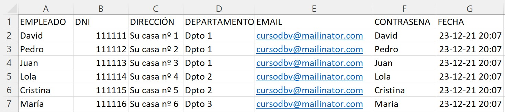
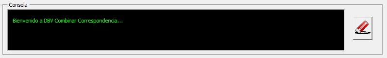

# Ayuda de la aplicación Combinar Correspondencia
La ayuda de la aplicación de divide en 3 apartados(nuevo):
1. [Instalación](README.md)
2. [Preparación del documento combinado](Ayuda.md#preparaci%C3%B3n-del-documento-combinado)
3. [Uso de la aplicación](Ayuda.md#usando-dbv-combinar-correspondencia)
4. [Video Tutoriales](README.md#video-tutoriales)
5. [Curso de Microsoft Word](Readme.md#curso-de-microsoft-word)

## Preparación del documento combinado

 Si le resulta más facil, puede ver el [video tutorial sobre el uso de la aplicación](https://youtu.be/CeAmDicTyQo) (Pendiente de actualización)

 Utilizando un documento excel como el que se encuentra en [Ejemplos/empleadosv2.0.xlsx](Ejemplos/empleadosv2.0.xlsx):
 
 
 y un documento como [Ejemplos/cartaempleadosv2.0.docx](Ejemplos/cartaempleadosv2.0.docx) que antes de combinar quedaría así:
  
  
  y después de combinar:
   
 
 
 Se debe realizar la correspondencia con un documento word generando un archivo único (En Word->Correspondencia->Finalizar y Combinar->Editar Documentos Individuales->Todos. Ver ejemplo en: [#1 Combinar correspondencia y generar PDFs individuales](https://youtu.be/PJYR6Cc9ovU). Desde el documento que se genere, será desde el que funcione nuestra aplicación.

 IMPORTANTE: El contenido del video es válido para las versiones posteriores a la 1.3 en lo relativo a los caracteres especiales. A partir de la versión 1.3 donde antes se ponía:
 1. Para el nombre del archivo:
   Versiones 1.2 y anteriores -  Antes de combinar: _«EMPLEADO»- despues de combinar: _David-  
Versión 1.3 y posteriores- Antes de combinar: DBV_NOMBRE«EMPLEADO» DBV_FIN  después de combinar: DBV_NOMBREDavidDBV_FIN

1. Para el correo electrónico:
Versiones 1.2 y anteriores - Antes de combinar: ç«EMAIL»ç después de combinar: çcursodbv@mailinator.comç
Versión 1.3 y posteriores- Antes de combinar: DBV_CORREO«EMAIL»DBV_FIN  después de combinar: DBV_CORREOcursodbv@mailinator.comDBV_FIN
 
3. Para que funcione la opción "Contraseña individual", hay que generar:
Versiones 1.2 y anteriores - Antes de combinar: ´«CONTRASENA»´  y después de combinar: ´DavidSecreto´
Versión 1.3 y posteriores- Antes de combinar: DBV_CONTRA«CONTRASENA»DBV_FIN  después de combinar: DBV_CONTRADavidSecretoDBV_FIN

4. Solo disponible desde la versión 2.0 está la fecha de retraso de envío: DBV_FECHA«FECHA»DBV_FIN después de combinar DBV_FECHA12/23/2021 8:07:00 PMDBV_FIN
 
## Usando DBV Combinar Correspondencia
Una vez generado el archivo único que contendrá todos los documentos independientes, se puede usar la herramienta. Veremos a continuación los distintos campos de la misma con sus variaciones.
### Carpeta Destino

En la carpeta destino hay que seleccionar una carpeta del equipo que YA EXISTA y será en la que se guarden los documentos generados. 
### Páginas por documento
Aquí hay que indicar un número que es el número de páginas de cada documento individual con el que se hace la combinación por correspondencia. Es decir, el documento con el que combinamos tiene 2 páginas y el documento final, que genera 20 cartas diferentes tiene 40 páginas, en este campo habrá que poner 2. 
### Nombre Documentos
Existen dos formas de generar los nombres de los documentos. De forma genérica o de forma personalizada. La opción se elige pulsando el Checkbox "Nombres archivos personalizados". En el caso en no esté seleccionado los documentos se generan con nombres consecutivos numerados, tomando como base el campo "Nombre documentos", por ejemplo, si en "Nombre Documentos" aparece "misdocs", los documentos que se generaran serán:misdocs1.pdf, misdocs2.pdf, ...

Si se selecciona el checkbox nombre archivos personalizados, se desabilita el campo nombre documentos, y el nombre que se tomará será el que debe aparecer en cada uno de los documentos combinados, con la combinación especial DBV_NOMBREnombreDBV_FIN. Es decir que si en la página aparece DBV_NOMBREdavidDBV_FIN  el documento que se generará sera david.pdf  
### Correos

Si se mantiene el checkbox "Enviar correo" desabilitado no se envía ningún correo. 
Si se activa, el módulo de inteligencia artificial (ahora todo el mundo mete inteligencia artificial por todas partes ;) busca las cuentas que tenga el usuario en el Outlook del PC, para ello es requisito tener Outlook instalado con al menos una cuenta válida y haría falta que se hubiera iniciado, para que Word pudiera conectar con la Aplicación de Outlook (aunque esté en segundo plano).  Habrá que seleccionar en el desplegable la cuenta desde la que se quieren enviar los correos.

Opcionalmente se pueden añadir adjuntos que serán comunes a todos los correos. Esto se hará con el icono de añadir adjuntos (cuando se abre el cuadro de diálogo se puede realizar una selección múltiple de archivos usando ctrl o mayusculas). También hay un icono para borrar todos los adjuntos seleccionados.

Los correos se enviarán a las direcciones que aparezcan en el documento, al igual que en el caso del nombre llevará una codificación con DBV_CORREO  DBV_FIN. Ejemplo:  DBV_CORREOcursodbv@mailinator.comDBV_FIN (para más información ver apartado de "preparación de documento combinado")

En el campo de texto cuerpo del mensaje, que solo se activa al seleccionar el Checkbox de "Enviar Correo", se puede poner un texto genérico que se enviará a todos los usuarios igual, ya que la gracia está en el documento adjunto. (Si se recibe una demanda importante, en un futuro se podrían añadir campos como el nombre para poder personalizar el contenido...)

#### Envio Retrasado

En algunas situaciones puede ser necesario que los correos no se envíen en el momento, si no que se retrasen en el tiempo. Pudiendo darse dos tipos de circustancias. Que quieran restrasarse todos los correos a una fecha concreta, todos igual, o que se quiera indicar una fecha distinta para cada correo, por ejemplo para enviar en fecha de cumpleaños una felicitación, o si somos una compañia de seguros, para enviarlo antes de que caduque la póliza.  Ambas opciones son posibles. Para ello solo hay que marcar el checkbox "Retrasar Envios" que aparece tras seleccionar enviar correos. Si se quiere que todos los correos se envíen en la misma fecha habrá que marcar "Igual para todos" como se muestra en la siguiente imagen.

Si se marca personalizado. La fecha de cada envío se incluyen en el excel (ver arriba) en una columna FECHA que debe tener formato fecha para que se genere correctamente. Como también hemos visto en el ejemplo arriba, en nuestro documento combinado hay que poner el código DBV_FECHA  DBV_FIN. Quedando después de combinar algo como: DBV_FECHA12/23/2021 8:07:00 PMDBV_FIN

#### Envío en dos fases
Algunos usuarios han necesitado firmar los documentos después de generarlos. Esa funcionalidad está disponible desde la versión 2.0 y para ello ha habido que separar el proceso en dos Fases. En la primera fase se generan los documentos. Luego externamente se firman y en la segunda fase se envían. 

1. Para activar este proceso hay que marcar el botón que pone "1 Fase" en la zona de correo y podrán verse los siguientes cambios: Al activar las dos fases el botón Aceptar de la parte inferior de la ventana desaparece y se crean dos botones nuevos: "Fase 1. Generación" y "Fase 2. Envío". A continuación se muestran las ventanas para una y dos fases.

En la ventana de dos fases aparece además el atributo extensión que se comentará a continuación.

1. Para cada fase se necesita un documento combinado que puede ser el mismo o diferente (la única diferencia serán los atributos combinados que se pongan en cada fase). De los 4 atributos posibles DBV_NOMBRE,DBV_CORREO,DBV_CONTRA, DBV_FECHA en la primera fase solo se utilizarán: DBV_NOMBRE y DBV_CONTRA (si estuvieran). Por lo que el documento combinado podría tener sólo esos dos. 
   En la segunda fase solo se necesita DBV_NOMBRE,DBV_CORREO y DBV_FECHA (si estuvieran).
   Si se reutiliza el mismo documento combinado deber tener todos los atributos como cuando se creó. (ya que al combinarlos se eliminan, pulsando ctrl+Z varias veces en el documento se vuelve al estado de generación original)
2. FASE 1. Se coge el documento combinado, se seleccionan los parámetros de la aplicación y se pulsa el botón "Fase 1. Generación". Con esto tendremos una lista de ficheros generados en la carpeta indicada.
3. Para firmarlos fuera de la aplicación se puede usar  [Autofirma](https://firmaelectronica.gob.es/Home/Descargas.html). Arrastrando todos los ficheros a la zona gris, se firmarán electrónicamente con el certificado que tengamos en el equipo y se generaran ficheros con el mismo nombre con la extensión signed.

4. Arrastramos todos los ficheros y pulsamos Firmar.

5. Seleccionamos la misma carpeta de origen y se obtiene lo siguiente:

6. FASE 2. Volvemos a nuestro word combinado original que tiene que tener todos los atributos necesarios como cuando se generó. Revisamos las opciones que sean las mismas que para la fase 1 (carpeta destino, nombre documentos, enviar correo, retrasar envios,...) y pulsamos Fase 2. Si todo ha ido bien, la magia surgirá y se enviarán los correos firmados. 

NOTA: Entiendo que es dificil explicar esto con texto. Haré un vídeo en cuanto pueda y se verá que es más sencillo de lo que parece :-)

### Contraseña

Para poner contraseña a un PDF se necesita instalar PDFCreator. Este no es necesario para poner contraseña a archivos .docx

Respecto a las contraseñas existen tres opciones:
1. Sin contraseña. Que no requiere instalar PDFCreator y no protegerá los documentos generados
2. Contraseña única. Que mostrará el "campo contraseña" que se ve en la imagen, y podrá escribirse una contraseña que servirá para abrir todos los documentos generados.
3. Contraseña individual. Genera una contraseña diferente para cada usuario, y para ello, en el documento base debe aparecer en una página de cada documento a generar, al igual que pasa con el nombre y el correo, un campo con la comilla ´ (comilla a la derecha de la ñ)  ejemplo: ´DavidSecreto´

### Tipo Documento

Los documentos que se pueden generar serán de tipo Word .docx o PDF .pdf. Dentro de los PDF podremos tener PDF estándar y PDF/A. Tanto los documentos Word generados como los PDF estándares pueden protegerse con contraseña. 
IMPORTANTE:Si se elige formato PDF/A para los archivos generados, estos no podrán llevar contraseña. El formato PDF/A se utiliza para que los documentos generados puedan durar en el tiempo, por lo que en la mayoría de los casos será suficiente con un PDF estándar.

### Consola

En la consola se mostrará la información de lo que vaya pasando. Pudiendo vaciar su contenido con el botón limpiar consola. 
### Aceptar

Cuando se han configurado todos los parámetros, se pulsa el botón Aceptar para iniciar la generación de los documentos pdf, envios de correo, con las opciones que se hayan seleccionado. 
### Salir
Pulsando el botón Salir se cierra la aplicación.
### Donar y Ayuda
El botón [Donar](https://www.paypal.com/donate?hosted_button_id=J5DXQN5VCBTVE) esta hecho solo para tí, que sientes que has encontrado la aplicación de tu vida para combinar correspondiencia y que gracias a ella te estas ahorrando muchas horas de trabajo. Estás deseando agradecer al programador su trabajo y no puedes evitar pulsar este botón [Donar](https://www.paypal.com/donate?hosted_button_id=J5DXQN5VCBTVE)  ;-)
### Ayuda
El botón de Ayuda lleva a este documento. 
