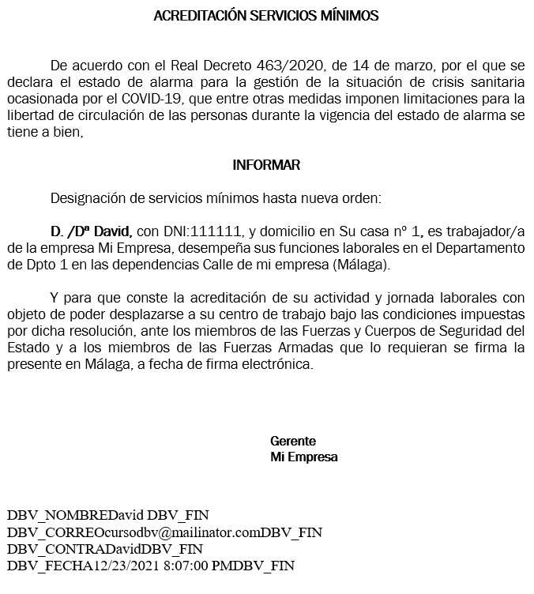
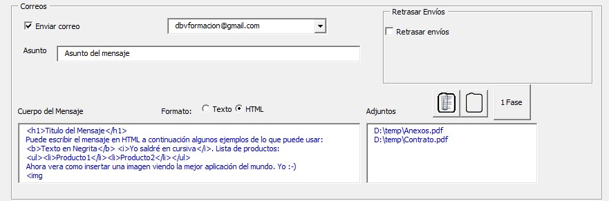

# Ayuda de la aplicación Combinar Correspondencia
La ayuda de la aplicación de divide en 3 apartados:
1. [Instalación](README.md)
2. [Preparación del documento combinado](Ayuda.md#preparaci%C3%B3n-del-documento-combinado)
3. [Uso de la aplicación](Ayuda.md#usando-dbv-combinar-correspondencia)
4. [Video Tutoriales](README.md#video-tutoriales)
5. [Curso de Microsoft Word](Readme.md#curso-de-microsoft-word)

## Preparación del documento combinado

 Si le resulta más facil, puede ver el [video tutorial sobre el uso de la aplicación](https://youtu.be/CeAmDicTyQo)

 Utilizando un documento excel como el que se encuentra en [Ejemplos/empleadosv4.xlsx](Ejemplos/empleadosv4.xlsx):
 
 
 y un documento como [Ejemplos/cartaempleadosv4.docx](Ejemplos/cartaempleadosv4.docx) que antes de combinar quedaría así:
  
  
  y después de combinar:
   
 
 
 Se debe realizar la correspondencia con un documento word generando un archivo único (En Word->Correspondencia->Finalizar y Combinar->Editar Documentos Individuales->Todos. Ver ejemplo en: [#1 Combinar correspondencia y generar PDFs individuales](https://youtu.be/PJYR6Cc9ovU). Desde el documento que se genere, será desde el que funcione nuestra aplicación.
 
 El documento debe tener una entrada especial para los casos de: "nombres de archivo personalizado", "envio a correo electrónico" y "generación de contraseña individual". que serían los siguientes.
 1. Para que funcione correctamente el botón de "Nombres archivos personalizados"  deberá aparecer en una de las páginas de cada documento el caracter _ seguido del nombre del archivo y terminado en el un guión - . Ejemplo, antes de combinar: _«EMPLEADO»- despues de combinar: _David-
 2. Para que funcione bien el envío a correo deberá aparecer en una de las páginas de cada documento la dirección de correo con el caracter ç al inicio y al final. Ejemplo, antes de combinar: ç«EMAIL»ç después de combinar: çcursodbv@mailinator.comç
 3. Para que funcione la opción "Contraseña individual", hay que generar ´ (comilla a la derecha de la ñ)  contraseña para el archivo y de nuevo ´. Ejemplo, antes de combinar: ´«CONTRASENA»´  y después de combinar: ´DavidSecreto´
## Usando DBV Combinar Correspondencia
Una vez generado el archivo único que contendrá todos los documentos independientes, se puede usar la herramienta. Veremos a continuación los distintos campos de la misma con sus variaciones.
### Carpeta Destino

En la carpeta destino hay que seleccionar una carpeta del equipo que YA EXISTA y será en la que se guarden los documentos generados. 
### Páginas por documento
Aquí hay que indicar un número que es el número de páginas de cada documento individual con el que se hace la combinación por correspondencia. Es decir, el documento con el que combinamos tiene 2 páginas y el documento final, que genera 20 cartas diferentes tiene 40 páginas, en este campo habrá que poner 2. 
### Nombre Documentos
Existen dos formas de generar los nombres de los documentos. De forma genérica o de forma personalizada. La opción se elige pulsando el Checkbox "Nombres archivos personalizados". En el caso en no esté seleccionado los documentos se generan con nombres consecutivos numerados, tomando como base el campo "Nombre documentos", por ejemplo, si en "Nombre Documentos" aparece "misdocs", los documentos que se generaran serán:misdocs1.pdf, misdocs2.pdf, ...

Si se selecciona el checkbox nombre archivos personalizados, se desabilita el campo nombre documentos, y el nombre que se tomará será el que debe aparecer en cada uno de los documentos combinados, con la combinación especial _nombre-. Es decir que si en la página aparece _david-  el documento que se generará sera david.pdf  
### Correos

Si se mantiene el checkbox "Enviar correo" desabilitado no se envía ningún correo. 
Si se activa, el módulo de inteligencia artificial (ahora todo el mundo mete inteligencia artificial por todas partes ;) busca las cuentas que tenga el usuario en el Outlook del PC, para ello es requisito tener Outlook instalado con al menos una cuenta válida y haría falta que se hubiera iniciado, para que Word pudiera conectar con la Aplicación de Outlook (aunque esté en segundo plano).  Habrá que seleccionar en el desplegable la cuenta desde la que se quieren enviar los correos.

Opcionalmente se pueden añadir adjuntos que serán comunes a todos los correos. Esto se hará con el icono de añadir adjuntos (cuando se abre el cuadro de diálogo se puede realizar una selección múltiple de archivos usando ctrl o mayusculas). También hay un icono para borrar todos los adjuntos seleccionados.

Los correos se enviarán a las direcciones que aparezcan en el documento, al igual que en el caso del nombre llevará una codificación con el caracter ç. Ejemplo:  çcursodbv@mailinator.comç (para más información ver apartado de "preparación de documento combinado")

En el campo de texto cuerpo del mensaje, que solo se activa al seleccionar el Checkbox de "Enviar Correo", se puede poner un texto genérico que se enviará a todos los usuarios igual, ya que la gracia está en el documento adjunto. (Si se recibe una demanda importante, en un futuro se podrían añadir campos como el nombre para poder personalizar el contenido...)

### Contraseña

Para poner contraseña a un PDF se necesita instalar PDFCreator. Este no es necesario para poner contraseña a archivos .docx

Respecto a las contraseñas existen tres opciones:
1. Sin contraseña. Que no requiere instalar PDFCreator y no protegerá los documentos generados
2. Contraseña única. Que mostrará el "campo contraseña" que se ve en la imagen, y podrá escribirse una contraseña que servirá para abrir todos los documentos generados.
3. Contraseña individual. Genera una contraseña diferente para cada usuario, y para ello, en el documento base debe aparecer en una página de cada documento a generar, al igual que pasa con el nombre y el correo, un campo con la comilla ´ (comilla a la derecha de la ñ)  ejemplo: ´DavidSecreto´

### Tipo Documento

Los documentos que se pueden generar serán de tipo Word .docx o PDF .pdf. Dentro de los PDF podremos tener PDF estándar y PDF/A. Tanto los documentos Word generados como los PDF estándares pueden protegerse con contraseña. 
IMPORTANTE:Si se elige formato PDF/A para los archivos generados, estos no podrán llevar contraseña. El formato PDF/A se utiliza para que los documentos generados puedan durar en el tiempo, por lo que en la mayoría de los casos será suficiente con un PDF estándar.

### Consola

En la consola se mostrará la información de lo que vaya pasando. Pudiendo vaciar su contenido con el botón limpiar consola. 
### Aceptar

Cuando se han configurado todos los parámetros, se pulsa el botón Aceptar para iniciar la generación de los documentos pdf, envios de correo, con las opciones que se hayan seleccionado. 
### Salir
Pulsando el botón Salir se cierra la aplicación.
### Donar y Ayuda
El botón [Donar](https://www.paypal.com/donate?hosted_button_id=J5DXQN5VCBTVE) esta hecho solo para tí, que sientes que has encontrado la aplicación de tu vida para combinar correspondiencia y que gracias a ella te estas ahorrando muchas horas de trabajo. Estás deseando agradecer al programador su trabajo y no puedes evitar pulsar este botón [Donar](https://www.paypal.com/donate?hosted_button_id=J5DXQN5VCBTVE)  ;-)
### Ayuda
El botón de Ayuda lleva a este documento. 
