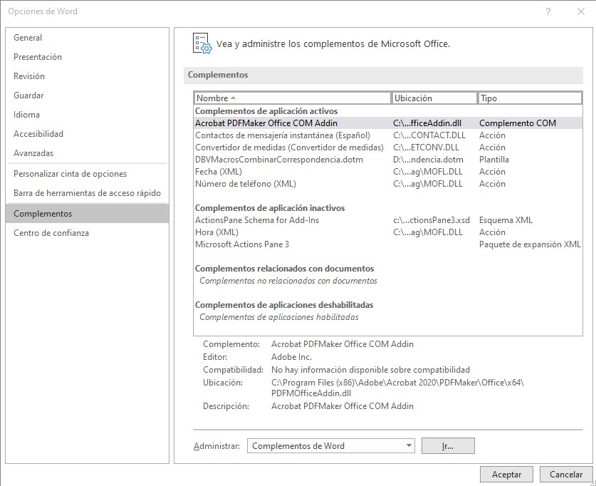
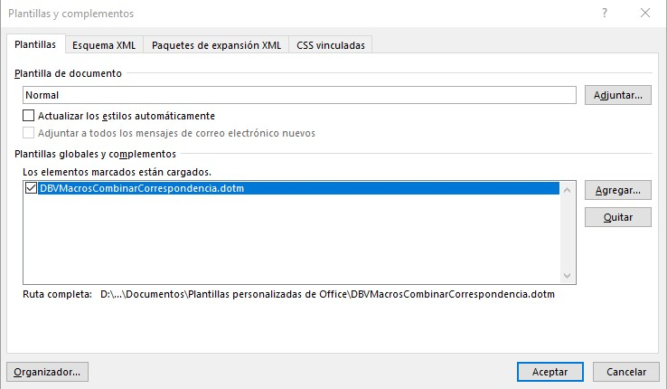
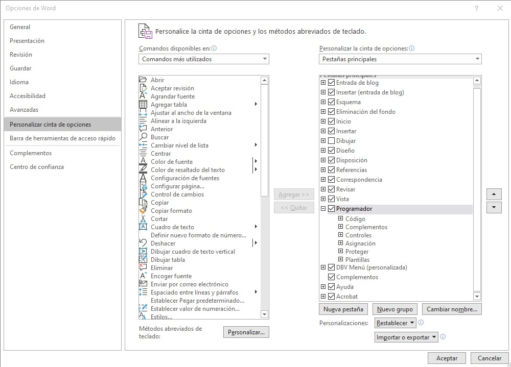
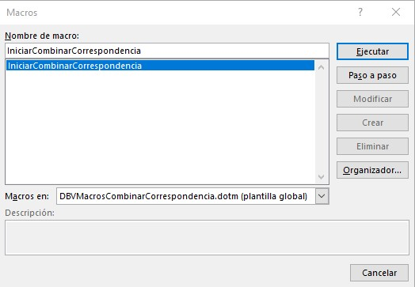
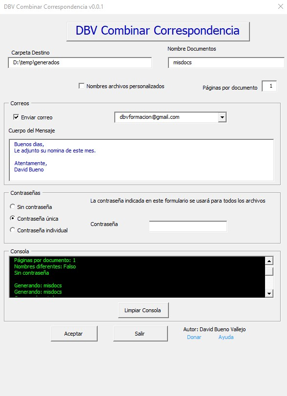
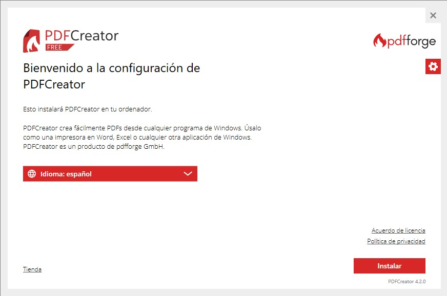
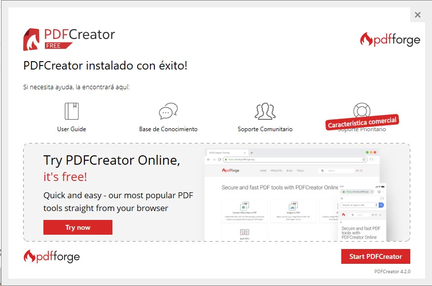

# Combinar Correspondencia
 Este proyecto permite realizar combinaciones de correspondencia avanzadas con Microsoft Word, con las siguientes funciones:
 1. El usuario puede elegir el formato de archivos destino: pdfs o .docx
 2. Tanto PDF como Word se pueden proteger con contraseña
 3. La contraseña puede ser igual para todos los documentos o específica para cada uno.
 4. Se puede dar un nombre genérico o único a cada documento generado
 5. Se puede seleccionar la carpeta donde se guardarán los documentos
 6. Se puede elegir enviar los documentos por correos definiendo el asunto y cuerpo del mensaje.
 7. Si se elige enviar correo, se buscarán automáticamente las cuentas existentes en outlook para poder seleccionar una.
 8. Si se envía un correo, se pueden enviar tantos archivos como se quieran como adjuntos comunes
 9. Se puede seleccionar el número de páginas que tendrá cada subdocumento 
 10. Si se utiliza exportación a word, el número de páginas se selecciona automáticamente (usando las secciones)
 11. Se dispone de una consola para obtener información sobre proceso, errores y resultado.

  Los apartados principales son:
 
1. [Instalación](#instalaci%C3%B3n)
2. [Preparación del documento combinado](Ayuda.md#preparaci%C3%B3n-del-documento-combinado)
3. [Uso de la aplicación](Ayuda.md#usando-dbv-combinar-correspondencia)
4. [Video Tutoriales](README.md#video-tutoriales)
5. [Curso de Microsoft Word](CombinarCorrespondencia.md#curso-de-microsoft-word)
6. [El Origen](origen.md#origen)
7. [Sobre el Autor](README.md#sobre-el-autor) 
 
## Instalación
La aplicación viene en un único documento de plantillas de Microsoft Word que se llama DBVMacrosCombinarCorrespondencia.dotm (en la carpeta Aplicación). 
Si no te gusta leer mucho, puedes ver los pasos para instalarlo en este [vídeo tutorial de la instalación](https://youtu.be/GCoHx2JaaMI)

1. La recomendación de instalación es guardarlo en la carpeta de plantillas. Normalmente: C:\Usuarios\[nombre usuario]\Documentos\Plantillas personalizadas de Office
2. Después hay que seleccionar la plantilla como activa en: Archivo->Opciones de Word->Complementos->Administrar->Complementos de Word ->Ir
  
3. Después hay que seleccionar la plantilla para que pueda verse desde cualquier documento como se muestra en la imagen.Con esto ya estará la Macro disponible para ejecutarse desde cualquier documento.
 

    

 
 4. (opcional) Para poder ver las macro hay que tener activada la pestaña programador. Si ya la tiene puede saltarse este paso, sino. en Archivo->Opciones->Personalizar Cinta de Opciones, se debe activar la casilla Programador que da acceso a las Macros.
 

    
    

  
 5. La macro se puede ejecutar desde el Menu Vista-> Macro->Ver Macro-> IniciarCombinarCorrespondencia
  

    
    

 
 6. Si todo ha ido bien Debería aparecer la siguiente ventana:
 
 

    
    

 7. Con lo realizado hasta ahora funcionará todo salvo la generación de contraseñas. Si no es necesario poner contraseña a los archivos no hay que hacer nada más, si no siga los siguientes pasos.
 8. Para poder poner contraseña a los pdf que se generan es necesario descargar la herramienta PDFCreator (freeware) que además de ser una herramienta muy potente para generar y usar archivos pdf, dispone de [una potente API](https://docs.pdfforge.org/pdfcreator/en/pdfcreator/com-interface/) en varios lenguajes de programación que facilita el uso de pdfs desde nuestros programas. Para nuestra aplicación es suficiente con la versión gratuita, aunque la versión profesional tiene un coste de unos 16€/año (NOTA: PDF Creator no patrocina esta Web). Habría que descargar PDFCreator [aquí](https://www.pdfforge.org/pdfcreator/download).  Siga los pasos del asistente y puede rechazar si le pide instalar un antivirus. Probablemente instale PDFArchitect que se puede desinstalar si no interesa, aunque es una herramienta simila a Adobe Acrobat.
 Primer paso del instalador...
 
 

    
    

 
 Última pantalla de la instalación.
 
 

    
    

 
 9. Con esto es suficiente y la aplicación de combianar correspondencia ya sería totalmente funcional.
 
 ## Preparación de documento combinado
 Los pasos se detallan en la Ayuda: [Preparación del documento combinado](Ayuda.md#preparaci%C3%B3n-del-documento-combinado)

## Usando DBV Combinar Correspondencia

PUedes ver como se usa en este [video sobre cómo usar la aplicación](https://youtu.be/CeAmDicTyQo)
o seguir los pasos que se detallan en la Ayuda: [Uso de la aplicación](Ayuda.md#usando-dbv-combinar-correspondencia)
## Video tutoriales
Para todos los que prefieren que les cuenten las cosas y ver como funcionan he creado los siguientes videos:
1. [Vídeo tutorial de la instalación](https://youtu.be/GCoHx2JaaMI)

2. [Tutorial sobre cómo usar la aplicación](https://youtu.be/CeAmDicTyQo)

## Origen
Te gustaría conocer la historia de por qué cree esta aplicación. Puedes verla en [El Origen](origen.md)

## Curso de Microsoft Word

Como complemento de lo que aquí se presenta, desarrollé un curso completo de uso de Microsoft Word que puede consultarse aquí: [Curso Aprende bien Microsoft Word](https://www.udemy.com/course/aprendemicrosoftword/?referralCode=53B4CF7B7C08F59F4EBA)

## Donar
El botón [Donar](https://www.paypal.com/donate?hosted_button_id=J5DXQN5VCBTVE) esta hecho solo para tí, que sientes que has encontrado la aplicación de tu vida para combinar correspondiencia y que gracias a ella te estas ahorrando muchas horas de trabajo. Estás deseando agradecer al programador su trabajo y no puedes evitar pulsar este botón [Donar](https://www.paypal.com/donate?hosted_button_id=J5DXQN5VCBTVE)  

 ## Sobre el Autor
 
  [linkedin - davidbueno](https://www.linkedin.com/in/davidbueno/)
  
  [twitter - davidbuenov](https://twitter.com/davidbuenov)
  
  [Youtube - davidbueno ](https://www.youtube.com/davidbueno)
  
  [Blogger - davidbuenov](http://davidbuenov.blogspot.com/)
  
  [Slideshare - davidbuenov](https://www.slideshare.net/davidbuenov)
  
  [Udemy](https://www.udemy.com/user/david-bueno-vallejo/)
  
  
  Dr. David Bueno Vallejo
 
 ## Ir a Inicio
[Ir a inicio](README.md#combinar-correspondencia)
