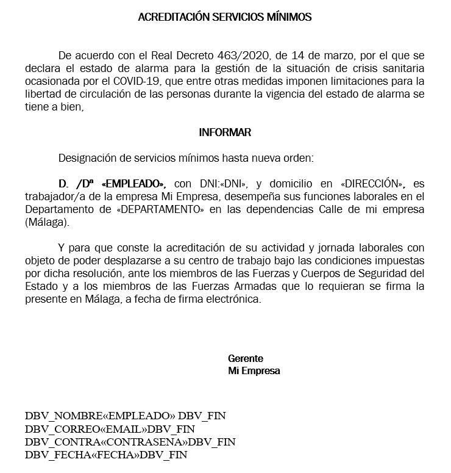
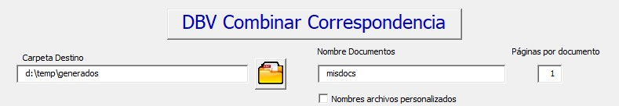
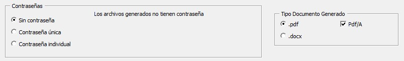

# Combinar Correspondencia
 Este proyecto permite realizar combinaciones de correspondencia avanzadas con Microsoft Word, donde el usuario puede elegir que se generen pdfs, que se protejan con contraseña, que cada documento tenga un nombre específico y que se envíen por correo.
 
## Instalación
La aplicación viene en un único documento de plantillas de Microsoft Word que se llama DBVMacrosCombinarCorrespondencia.dotm (en la carpeta Aplicación). 
1. La recomendación de instalación es guardarlo en la carpeta de plantillas. Normalmente: C:\Usuarios\[nombre usuario]\Documentos\Plantillas personalizadas de Office
2. Después hay que seleccionar la plantilla como activa en: Archivo->Opciones de Word->Complementos->Administrar->Complementos de Word ->Ir

3. Después hay que seleccionar la plantilla para que pueda verse desde cualquier documento como se muestra en la imagen.Con esto ya estará la Macro disponible para ejecutarse desde cualquier documento.

 
 4. (opcional) Para poder ver las macro hay que tener activada la pestaña programador. Si ya la tiene puede saltarse este paso, sino. en Archivo->Opciones->Personalizar Cinta de Opciones, se debe activar la casilla Programador que da acceso a las Macros.
  
 5. La macro se puede ejecutar desde el Menu Vista-> Macro->Ver Macro-> IniciarCombinarCorrespondencia
 
 6. Si todo ha ido bien Debería aparecer la siguiente ventana:
 
 7. Con lo realizado hasta ahora funcionará todo salvo la generación de contraseñas. Si no es necesario poner contraseña a los archivos no hay que hacer nada más, si no siga los siguientes pasos.
 8. Para poder poner contraseña a los pdf que se generan es necesario descargar la herramienta PDFCreator (freeware) que además de ser una herramienta muy potente para generar y usar archivos pdf, dispone de [una potente API](https://docs.pdfforge.org/pdfcreator/en/pdfcreator/com-interface/) en varios lenguajes de programación que facilita el uso de pdfs desde nuestros programas. Para nuestra aplicación es suficiente con la versión gratuita, aunque la versión profesional tiene un coste de unos 16€/año (NOTA: PDF Creator no patrocina esta Web). Habría que descargar PDFCreator [aquí](https://www.pdfforge.org/pdfcreator/download).  Siga los pasos del asistente y puede rechazar si le pide instalar un antivirus. Probablemente instale PDFArchitect que se puede desinstalar si no interesa, aunque es una herramienta simila a Adobe Acrobat.
 Primer paso del instalador...
 
 
 Última pantalla de la instalación.
 
 9. Con esto es suficiente y la aplicación de combianar correspondencia ya sería totalmente funcional.
 
 ## Preparación de documento combinado
 Utilizando un documento excel como el que se encuentra en [Ejemplos/empleadosv4.xlsx](Ejemplos/empleadosv4.xlsx):
 
 
 y un documento como [Ejemplos/cartaempleadosv4.docx](Ejemplos/cartaempleadosv4.docx) que antes de combinar quedaría así:
  
  
  y después de combinar:
   
 
 
 Se debe realizar la correspondencia con un documento word generando un archivo único (En Word->Correspondencia->Finalizar y Combinar->Editar Documentos Individuales->Todos. Ver ejemplo en: [#1 Combinar correspondencia y generar PDFs individuales](https://youtu.be/PJYR6Cc9ovU). Desde el documento que se genere, será desde el que funcione nuestra aplicación.
 
 El documento debe tener una entrada especial para los casos de: "nombres de archivo personalizado", "envio a correo electrónico" y "generación de contraseña individual". que serían los siguientes.
 1. Para que funcione correctamente el botón de "Nombres archivos personalizados"  deberá aparecer en una de las páginas de cada documento el caracter _ seguido del nombre del archivo y terminado en el un guión - . Ejemplo, antes de combinar: _«EMPLEADO»- despues de combinar: _David-
 2. Para que funcione bien el envío a correo deberá aparecer en una de las páginas de cada documento la dirección de correo con el caracter ç al inicio y al final. Ejemplo, antes de combinar: ç«EMAIL»ç después de combinar: çcursodbv@mailinator.comç
 3. Para que funcione la opción "Contraseña individual", hay que generar ´ (comilla a la derecha de la ñ)  contraseña para el archivo y de nuevo ´. Ejemplo, antes de combinar: ´«CONTRASENA»´  y después de combinar: ´DavidSecreto´
## Usando DBV Combinar Correspondencia
Una vez generado el archivo único que contendrá todos los documentos independientes, se puede usar la herramienta. Veremos a continuación los distintos campos de la misma con sus variaciones.
### Carpeta Destino

En la carpeta destino hay que seleccionar una carpeta del equipo que YA EXISTA y será en la que se guarden los documentos generados. 
### Páginas por documento
Aquí hay que indicar un número que es el número de páginas de cada documento individual con el que se hace la combinación por correspondencia. Es decir, el documento con el que combinamos tiene 2 páginas y el documento final, que genera 20 cartas diferentes tiene 40 páginas, en este campo habrá que poner 2. 
### Nombre Documentos
Existen dos formas de generar los nombres de los documentos. De forma genérica o de forma personalizada. La opción se elige pulsando el Checkbox "Nombres archivos personalizados". En el caso en no esté seleccionado los documentos se generan con nombres consecutivos numerados, tomando como base el campo "Nombre documentos", por ejemplo, si en "Nombre Documentos" aparece "misdocs", los documentos que se generaran serán:misdocs1.pdf, misdocs2.pdf, ...

Si se selecciona el checkbox nombre archivos personalizados, se desabilita el campo nombre documentos, y el nombre que se tomará será el que debe aparecer en cada uno de los documentos combinados, con la combinación especial _nombre-. Es decir que si en la página aparece _david-  el documento que se generará sera david.pdf  
### Correos

Si se mantiene el checkbox "Enviar correo" desabilitado no se envía ningún correo. 
Si se activa, el módulo de inteligencia artificial (ahora todo el mundo mete inteligencia artificial por todas partes ;) busca las cuentas que tenga el usuario en el Outlook del PC, para ello es requisito tener Outlook instalado con al menos una cuenta válida y haría falta que se hubiera iniciado, para que Word pudiera conectar con la Aplicación de Outlook (aunque esté en segundo plano).  Habrá que seleccionar en el desplegable la cuenta desde la que se quieren enviar los correos.

Los correos se enviarán a las direcciones que aparezcan en el documento, al igual que en el caso del nombre llevará una codificación con el caracter ç. Ejemplo:  çcursodbv@mailinator.comç (para más información ver apartado de "preparación de documento combinado")

En el campo de texto cuerpo del mensaje, que solo se activa al seleccionar el Checkbox de "Enviar Correo", se puede poner un texto genérico que se enviará a todos los usuarios igual, ya que la gracia está en el documento adjunto. (Si se recibe una demanda importante, en un futuro se podrían añadir campos como el nombre para poder personalizar el contenido...)

### Contraseña

Respecto a las contraseñas existen tres opciones:
1. Sin contraseña. Que no requiere instalar PDFCreator y no protegerá los documentos generados
2. Contraseña única. Que mostrará el "campo contraseña" que se ve en la imagen, y podrá escribirse una contraseña que servirá para abrir todos los documentos generados.
3. Contraseña individual. Genera una contraseña diferente para cada usuario, y para ello, en el documento base debe aparecer en una página de cada documento a generar, al igual que pasa con el nombre y el correo, un campo con la comilla ´ (comilla a la derecha de la ñ)  ejemplo: ´DavidSecreto´

### Consola

En la consola se mostrará la información de lo que vaya pasando. Pudiendo vaciar su contenido con el botón limpiar consola. 
### Aceptar

El 
### Salir
### Donar y Ayuda

## Origen
Todo empezo con un video en el que se explicaba la combinación por correspondencia sencilla, válida para la mayoría de los usuarios. Además se explicaba como hacer para generar documentos .pdf. Esa generación se hace usando una macro con VBA. 

 [#1 Combinar correspondencia y generar PDFs individuales](https://youtu.be/PJYR6Cc9ovU)

Al publicar ese primer video surgieron muchas preguntas sobre como se podría hacer para que los documentos no se generasen con un nombre genérico, sino con un nombre específico que pudiera obtenerse del mismo excel con el que se realizaba la combinación. El resultado fue el segundo video:

 [#2 Combinar correspondencia y generar PDFs individuales seleccionando nombre archivos](https://youtu.be/Lu64q5-2ABA)

Los usuarios del [canal de youtube](https://www.youtube.com/c/DavidBuenoVallejo) seguían solicitando nuevas funcionalidades como que se pudieran enviar por correo los pdfs generados con nombres independientes. Esto dio lugar a la tercera versión:

 [#3 Combinar Correspondencia en PDFs con nombres individuales y enviarlos por correo](https://youtu.be/OaHKKyT0ke0)

Esas tres versiones podían hacerse con una macro VBA recogiendo diferentes parámetros a través de MsgBox sin necesidad de ninguna librería adicional. Todos los documentos usado y ejemplos están disponibles en la carpeta [Tutoriales](Tutoriales) de este proyecto. Pero cuando en el canal pidieron una nueva actualización, todo se complicó un poco. Las últimas peticiones estaban relacionadas con añadir contraseñas a los archivos generados y eso no se podía hacer ni con adobe profesional, ni sin usar librerías. Después de buscar algo que permitiera realizar todo el proceso de generación de los tres videos y además poder generar una firma para los documentos dio lugar a este proyecto, ya que necesitaba unir todo el trabajo realizado en un único sitio. 

## Curso de Microsoft Word

Como complemento de lo que aquí se presenta, desarrollé un curso completo de uso de Microsoft Word que puede consultarse aquí: [Curso Aprende bien Microsoft Word](https://www.udemy.com/course/aprendemicrosoftword/?referralCode=53B4CF7B7C08F59F4EBA)

 Si el contenido de esta entrada de ha ahorrado mucho trabajo puedes hacer una pequeña donación para apoyar que se sigan creando contenidos interesantes de forma gratuita. [Donar](https://www.paypal.com/donate?hosted_button_id=J5DXQN5VCBTVE)
 
 ## Sobre el Autor
  [linkedin - davidbueno](https://www.linkedin.com/in/davidbueno/)
  [twitter - davidbuenov](https://twitter.com/davidbuenov)
  [Youtube - davidbueno ](https://www.youtube.com/davidbueno)
  
  Dr. David Bueno Vallejo
 
 
