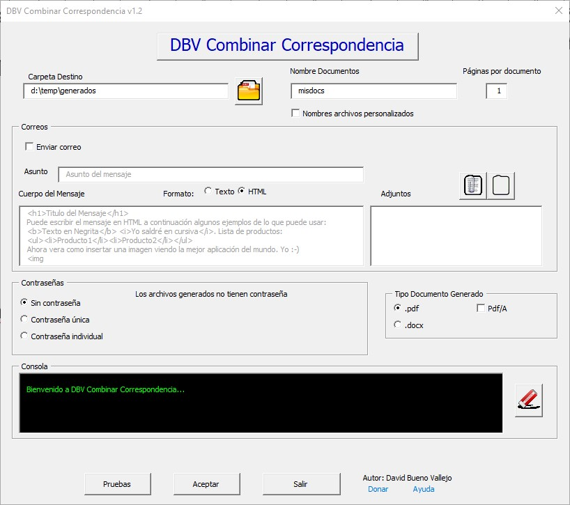
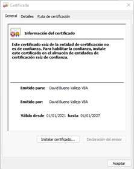

# Combinar Correspondencia
 Este proyecto permite realizar combinaciones de correspondencia avanzadas con Microsoft Word, con las siguientes funciones:
 1. El usuario puede elegir el formato de archivos destino: pdfs(estándares o PDF/A) o .docx
 2. Tanto PDF estándar como Word se pueden proteger con contraseña (no los PDF/A)
 3. La contraseña puede ser igual para todos los documentos o específica para cada uno.
 4. Se puede dar un nombre genérico o único a cada documento generado
 5. Se puede seleccionar la carpeta donde se guardarán los documentos
 6. Se puede elegir enviar los documentos por correos definiendo el asunto y cuerpo del mensaje.
 7. El cuerpo del mensaje puede escribirse en texto plano o en HTML
 8. Si se elige enviar correo, se buscarán automáticamente las cuentas existentes en outlook para poder seleccionar una.
 9. Si se envía un correo, se pueden enviar tantos archivos como se quieran como adjuntos comunes
 10. Se puede seleccionar el número de páginas que tendrá cada subdocumento 
 11. Si se utiliza exportación a word, el número de páginas se selecciona automáticamente (usando las secciones)
 12. Se dispone de una consola para obtener información sobre proceso, errores y resultado.
 13. Se pueden separar la generación y el envío de los documentos en 2 Fases. Esto permite que se firmen externamente los documentos, por ejemplo, con portafirmas, y una vez que estén firmados que se envíen. 
 14. Permite el envío retrasado de los correos. De forma general, usando una fecha y hora para todos los correos o de forma personalizada con la nueva etiqueta DBVFECHA.

A partir de la versión 2.0 se entrega como una macro autofirmada para darle mayor seguridad al usuario.

  Los apartados principales son:
 
- [Combinar Correspondencia](#combinar-correspondencia)
  - [Instalación](#instalación)
    - [Instalación Básica](#instalación-básica)
    - [Instalación Contraseñas](#instalación-contraseñas)
    - [Instalación certificado](#instalación-certificado)
    - [Eliminar Advertencias de Seguridad](#eliminar-advertencias-de-seguridad)
    - [Instalación de la barra de herramientas](#instalación-de-la-barra-de-herramientas)
  - [Preparación de documento combinado](#preparación-de-documento-combinado)
  - [Usando DBV Combinar Correspondencia](#usando-dbv-combinar-correspondencia)
  - [Video tutoriales](#video-tutoriales)
  - [Origen](#origen)
  - [Curso de Microsoft Word](#curso-de-microsoft-word)
  - [Donar](#donar)
  - [Sobre el Autor](#sobre-el-autor)
  - [Ir a Inicio](#ir-a-inicio)
 
## Instalación
La aplicación viene en un único documento de plantillas de Microsoft Word que se llama DBVMacrosCombinarCorrespondencia.dotm (en la carpeta Aplicación). 
Si no te gusta leer mucho, puedes ver los pasos para instalarlo en esta [lista de vídeo tutoriales de la instalación](https://www.youtube.com/playlist?list=PLnNbmcjjevxuaT1lxybah8YnhoN4iAzVJ) en cada apartado se encuentra el vídeo específico.

### Instalación Básica

[2 DBV Combinar Correspondencia 2.0. Instalación Básica](https://www.youtube.com/watch?v=Rhtx0s7yfE8&list=PLnNbmcjjevxuaT1lxybah8YnhoN4iAzVJ&index=3&t=2s&ab_channel=DavidBuenoVallejo)

1. La recomendación de instalación es guardarlo en la carpeta de plantillas. Normalmente: C:\Usuarios\[nombre usuario]\Documentos\Plantillas personalizadas de Office
2. Después hay que seleccionar la plantilla como activa en: Archivo->Opciones de Word->Complementos->Administrar->Complementos de Word ->Ir
  
3. Después hay que seleccionar la plantilla para que pueda verse desde cualquier documento como se muestra en la imagen.Con esto ya estará la Macro disponible para ejecutarse desde cualquier documento.
 

    

 
 4. (opcional) Para poder ver las macro hay que tener activada la pestaña programador. Si ya la tiene puede saltarse este paso, sino. en Archivo->Opciones->Personalizar Cinta de Opciones, se debe activar la casilla Programador que da acceso a las Macros.
 

    
    

  
 5. La macro se puede ejecutar desde el Menu Vista-> Macro->Ver Macro-> IniciarCombinarCorrespondencia
  

    
    

 
 6. Si todo ha ido bien Debería aparecer la siguiente ventana:
 
 

    
    

### Instalación Contraseñas

[4 DBV Combinar Correspondencia 2.0. Instalación PDF Creator](https://www.youtube.com/watch?v=vuofYnj00nY&list=PLnNbmcjjevxuaT1lxybah8YnhoN4iAzVJ&index=5)

 1. Con lo realizado hasta ahora funcionará todo salvo la generación de contraseñas. Si no es necesario poner contraseña a los archivos no hay que hacer nada más, si no siga los siguientes pasos.
 2. Para poder poner contraseña a los pdf que se generan es necesario descargar la herramienta PDFCreator (freeware) que además de ser una herramienta muy potente para generar y usar archivos pdf, dispone de [una potente API](https://docs.pdfforge.org/pdfcreator/en/pdfcreator/com-interface/) en varios lenguajes de programación que facilita el uso de pdfs desde nuestros programas. Para nuestra aplicación es suficiente con la versión gratuita, aunque la versión profesional tiene un coste de unos 16€/año (NOTA: PDF Creator no patrocina esta Web). Habría que descargar PDFCreator [aquí](https://www.pdfforge.org/pdfcreator/download).  Siga los pasos del asistente y puede rechazar si le pide instalar un antivirus. Probablemente instale PDFArchitect que se puede desinstalar si no interesa, aunque es una herramienta simila a Adobe Acrobat.
 Primer paso del instalador...
 
 

    
    

 
 Última pantalla de la instalación.
 
 

    
    

 
 3. Con esto es suficiente y la aplicación de combinar correspondencia ya sería totalmente funcional.

### Instalación certificado

[3 DBV Combinar Correspondencia 2.0. Instalación del Certificado](https://www.youtube.com/watch?v=bMTvQuRNacM&list=PLnNbmcjjevxuaT1lxybah8YnhoN4iAzVJ&index=4&ab_channel=DavidBuenoVallejo)

Si se va a utilizar mucho la macro, lo recomendable es instalar el certificado asociado para que Microsoft Word no diga que hay peligro con la macro. El Certificado se encuentra en la carpeta Aplicacion al igual que la macro y se llama DBVCombinarCorrespondencia.cer. 
1. Hacer doble clic sobre el certificado.
   

    
    

2. Pulsar Instalar certificado...
    

    
    

3. Pulsar Siguiente (si al finalizar el proceso el certificado no estuviera bien instalados, seleccionar la segunda opción: "Colocar todos los certificados en el siguiente almacen"  y elegir "Entidades de certificación raíz de confianza")
 

    
    

4. Pulsar Siguiente
 

    
    

5. Al pulsar Finalizar aparece la siguiente advertencia. Verificar que la Huella Digital de la imagen coincide con la que aparece en la ventana, lo que implicará que es mi certificado y que no ha sido manipulado.
 

    
    

Al pulsar si, vemos que el certificado ya no tiene una x, en el icono del diploma
 

    
    

 ### Eliminar Advertencias de Seguridad
 Si se intenta abrir la macro o crear un documento basada en ella, veremos una imagen como esta: 

 

    
    

1. En lugar de pulsar sobre Habilitar Contenido (como hacemos con cada aplicación de móvil) vamos a pulsar en “Las macros se han deshabilitado” en la  pantalla anterior. Eso hará aparecer la siguiente pantlla y seleccionaremos "Opciones avanzadas"

    
    

En la siguiente pantalla seleccionamos "Confiar en todos los documentos de este editor"

    
    

A partir de este momento, al abrir la macro o algún documento basado en la macro, ya no aparecerán alertas de seguridad.

    
    

 

### Instalación de la barra de herramientas

Resulta muy fácil usar la aplicación si se instala un par de botones en la barra de herramientas. Eso se explica en el vídeo. [5 DBV Combinar Correspondencia 2.0. Instalar Barra Herramientas](https://www.youtube.com/watch?v=S0WhCmg7vkA&list=PLnNbmcjjevxuaT1lxybah8YnhoN4iAzVJ&index=6&ab_channel=DavidBuenoVallejo)

 ## Preparación de documento combinado
 Los pasos se detallan en la Ayuda: [Preparación del documento combinado](Ayuda.md#preparaci%C3%B3n-del-documento-combinado)

## Usando DBV Combinar Correspondencia

PUedes ver como se usa en los vídeos 6 a 9 de la  [lista de tutoriales de DBV Combinar Correspondencia](https://www.youtube.com/playlist?list=PLnNbmcjjevxuaT1lxybah8YnhoN4iAzVJ)
o seguir los pasos que se detallan en la Ayuda: [Uso de la aplicación](Ayuda.md#usando-dbv-combinar-correspondencia)
## Video tutoriales
Para todos los que prefieren que les cuenten las cosas y ver como funcionan he creado 11 videos que están en la lista de reproducción :

[lista de tutoriales de DBV Combinar Correspondencia](https://www.youtube.com/playlist?list=PLnNbmcjjevxuaT1lxybah8YnhoN4iAzVJ)

## Origen
Te gustaría conocer la historia de por qué cree esta aplicación. Puedes verla en [El Origen](origen.md)

## Curso de Microsoft Word

Como complemento de lo que aquí se presenta, desarrollé un curso completo de uso de Microsoft Word que puede consultarse aquí: [Curso Aprende bien Microsoft Word](https://www.udemy.com/course/aprendemicrosoftword/?referralCode=53B4CF7B7C08F59F4EBA)

## Donar
El botón [Donar](https://www.paypal.com/donate?hosted_button_id=J5DXQN5VCBTVE) esta hecho solo para tí, que sientes que has encontrado la aplicación de tu vida para combinar correspondiencia y que gracias a ella te estas ahorrando muchas horas de trabajo. Estás deseando agradecer al programador su trabajo y no puedes evitar pulsar este botón [Donar](https://www.paypal.com/donate?hosted_button_id=J5DXQN5VCBTVE)  

 ## Sobre el Autor
 
 Si te gustaría recibir novedades rellena este simple formulario. https://forms.gle/n2EUWcmBsCa4FscS6
 
  [linkedin - davidbueno](https://www.linkedin.com/in/davidbueno/)
  
  [twitter - davidbuenov](https://twitter.com/davidbuenov)
  
  [Youtube - davidbueno ](https://www.youtube.com/davidbueno)
  
  [Blogger - davidbuenov](http://davidbuenov.blogspot.com/)
  
  [Slideshare - davidbuenov](https://www.slideshare.net/davidbuenov)
  
  [Udemy](https://www.udemy.com/user/david-bueno-vallejo/)
  
  
  Dr. David Bueno Vallejo
 
 ## Ir a Inicio
[Ir a inicio](README.md#combinar-correspondencia)
